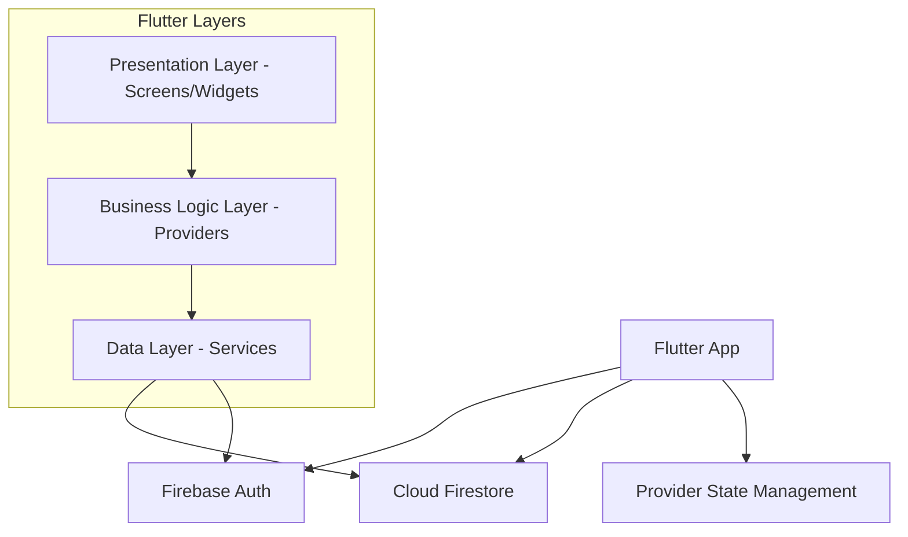
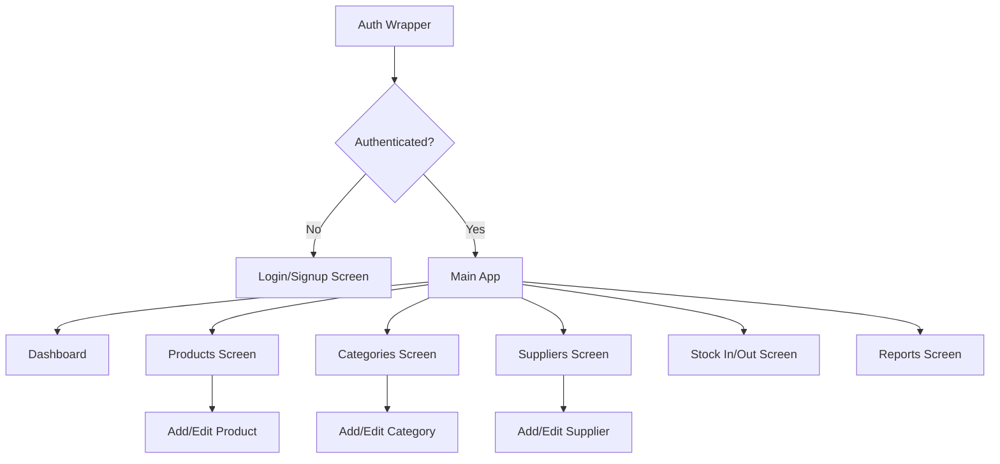

# Design Document

## Overview

The Stock Management App is a Flutter application with Firebase backend designed for hackathon demonstration. It features real-time inventory tracking, role-based authentication, and essential business analytics. The architecture prioritizes simplicity and rapid development while maintaining scalability for future enhancements.

## Architecture

### High-Level Architecture



### Technology Stack

- **Frontend**: Flutter (Dart)
- **Backend**: Firebase (Firestore + Auth)
- **State Management**: Provider
- **Real-time Updates**: Firestore Streams
- **Authentication**: Firebase Auth (Email/Password)

## Components and Interfaces

### Authentication Service

```dart
class AuthService {
  Future<User?> signInWithEmailPassword(String email, String password);
  Future<User?> createUserWithEmailPassword(String email, String password);
  Future<void> signOut();
  Stream<User?> get authStateChanges;
  Future<void> createUserDocument(User user, String role);
}
```

### Firestore Service

```dart
class FirestoreService {
  // User management
  Future<UserModel?> getUserData(String uid);
  Future<void> createUser(UserModel user);
  
  // Product management
  Stream<List<Product>> getProducts();
  Future<void> addProduct(Product product);
  Future<void> updateProduct(Product product);
  Future<void> deleteProduct(String productId);
  
  // Category management
  Stream<List<Category>> getCategories();
  Future<void> addCategory(Category category);
  Future<void> updateCategory(Category category);
  Future<void> deleteCategory(String categoryId);
  
  // Supplier management
  Stream<List<Supplier>> getSuppliers();
  Future<void> addSupplier(Supplier supplier);
  Future<void> updateSupplier(Supplier supplier);
  Future<void> deleteSupplier(String supplierId);
  
  // Transaction management
  Stream<List<Transaction>> getTransactions();
  Future<void> addTransaction(Transaction transaction);
  Future<void> updateProductStock(String productId, int newStock);
}
```

### State Management Providers

```dart
class AuthProvider extends ChangeNotifier {
  User? _user;
  UserModel? _userData;
  bool _isLoading = false;
  
  // Authentication methods and getters
}

class InventoryProvider extends ChangeNotifier {
  List<Product> _products = [];
  List<Category> _categories = [];
  List<Supplier> _suppliers = [];
  List<Transaction> _transactions = [];
  
  // CRUD methods and computed properties
}
```

## Data Models

### User Model
```dart
class UserModel {
  final String uid;
  final String email;
  final String role; // 'admin' or 'user'
  final DateTime createdAt;
}
```

### Product Model
```dart
class Product {
  final String id;
  final String name;
  final String categoryId;
  final String supplierId;
  final int stock;
  final double price;
  final DateTime createdAt;
  final DateTime updatedAt;
}
```

### Category Model
```dart
class Category {
  final String id;
  final String name;
  final DateTime createdAt;
}
```

### Supplier Model
```dart
class Supplier {
  final String id;
  final String name;
  final String contact;
  final DateTime createdAt;
}
```

### Transaction Model
```dart
class Transaction {
  final String id;
  final String productId;
  final String type; // 'in' or 'out'
  final int quantity;
  final DateTime date;
  final double priceAtTime;
}
```

## Screen Architecture

### Navigation Structure



### Screen Components

#### Dashboard Screen
- **Metrics Cards**: Total Products, Total Stock Value, Low Stock Count
- **Low Stock Alerts**: List of products with stock < 5
- **Quick Actions**: Navigation to main features

#### Products Screen
- **Product List**: StreamBuilder with real-time updates
- **Search/Filter**: By category or supplier
- **CRUD Actions**: Add, Edit, Delete (admin only)

#### Categories Screen
- **Category List**: Simple list with CRUD actions
- **Form Dialog**: Add/Edit category modal

#### Suppliers Screen
- **Supplier List**: Contact information display
- **Form Dialog**: Add/Edit supplier modal

#### Stock In/Out Screen
- **Product Selection**: Dropdown with search
- **Quantity Input**: Number input with validation
- **Transaction Type**: In/Out toggle
- **Submit**: Updates stock and logs transaction

#### Reports Screen
- **Filter Controls**: Date range, product, category filters
- **Transaction List**: Filtered transaction history
- **Summary Metrics**: Total sales, profit calculations

## Error Handling

### Authentication Errors
- Invalid credentials: Display user-friendly message
- Network errors: Retry mechanism with loading states
- Account creation failures: Validation feedback

### Firestore Errors
- Permission denied: Role-based error messages
- Network connectivity: Offline capability with local caching
- Data validation: Client-side validation before submission

### UI Error States
- Loading states for all async operations
- Error boundaries for widget failures
- Graceful degradation for missing data

## Testing Strategy

### Unit Tests
- Model serialization/deserialization
- Business logic in providers
- Service layer methods
- Utility functions

### Widget Tests
- Screen rendering with mock data
- Form validation
- Navigation flows
- Error state displays

### Integration Tests
- Authentication flow
- CRUD operations end-to-end
- Real-time data updates
- Role-based access control

### Firebase Testing
- Firestore security rules testing
- Authentication flow testing
- Data consistency validation

## Performance Considerations

### Real-time Updates
- Use Firestore streams with proper disposal
- Implement pagination for large datasets
- Cache frequently accessed data

### State Management
- Minimize provider rebuilds with selective listening
- Use computed properties for derived data
- Implement proper loading states

### UI Optimization
- Lazy loading for lists
- Image optimization and caching
- Minimize widget rebuilds

## Security Implementation

### Firestore Security Rules
```javascript
rules_version = '2';
service cloud.firestore {
  match /databases/{database}/documents {
    // Users can only read/write their own user document
    match /users/{userId} {
      allow read, write: if request.auth != null && request.auth.uid == userId;
    }
    
    // Only authenticated users can read inventory data
    // Only admins can write inventory data
    match /{document=**} {
      allow read: if request.auth != null;
      allow write: if request.auth != null && 
        get(/databases/$(database)/documents/users/$(request.auth.uid)).data.role == 'admin';
    }
  }
}
```

### Client-side Security
- Role-based UI rendering
- Input validation and sanitization
- Secure credential handling

## Deployment Configuration

### Firebase Configuration
- Development and production environments
- Firestore indexes for query optimization
- Authentication providers setup

### Flutter Build Configuration
- Platform-specific configurations
- Environment variables for Firebase config
- Build optimization for release